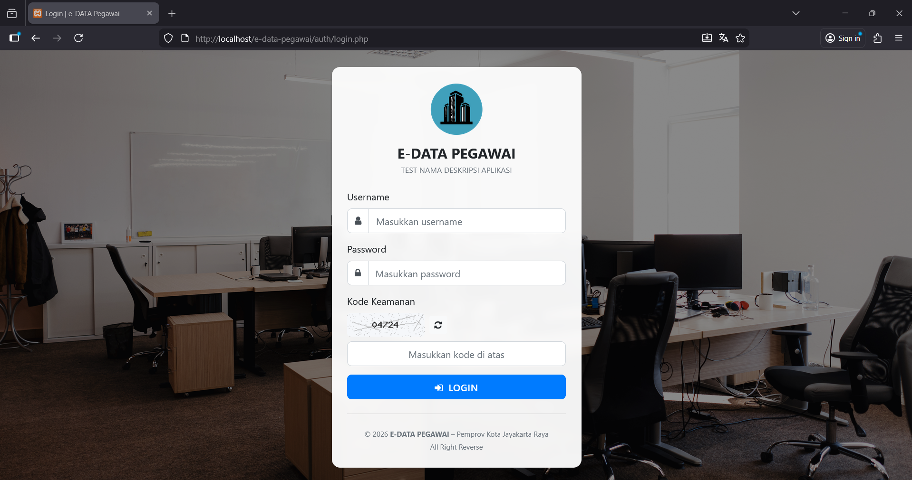
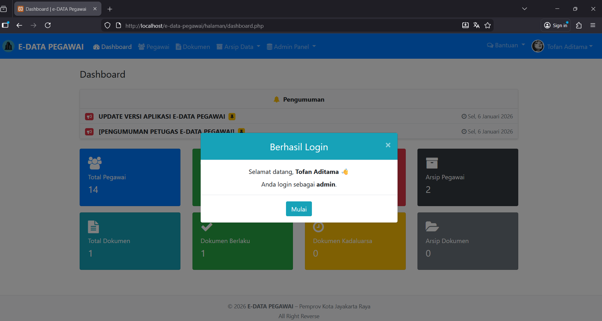
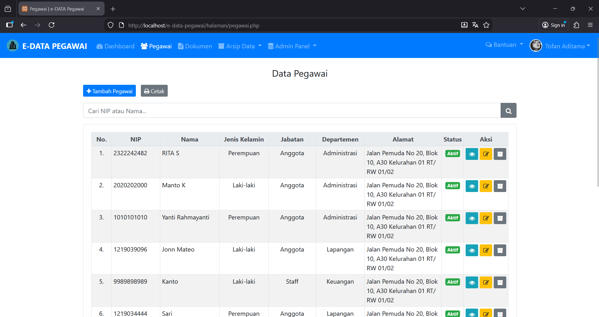
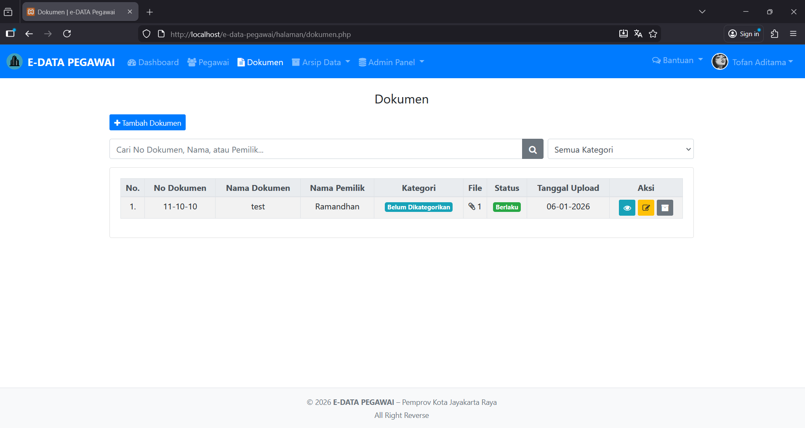
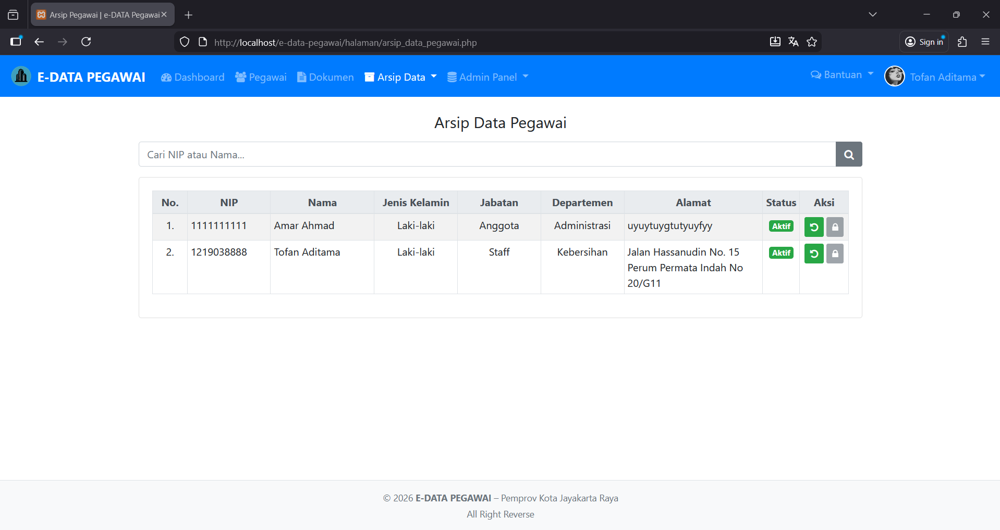
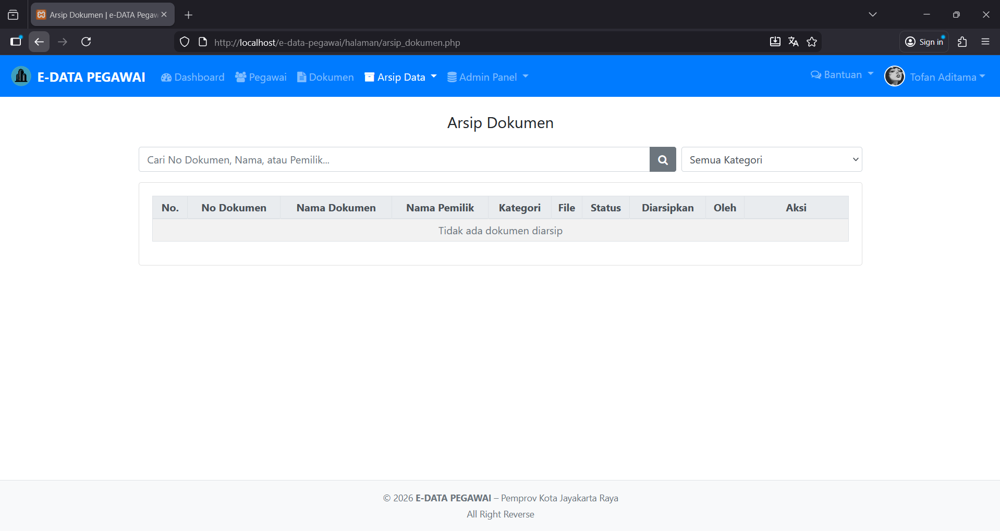
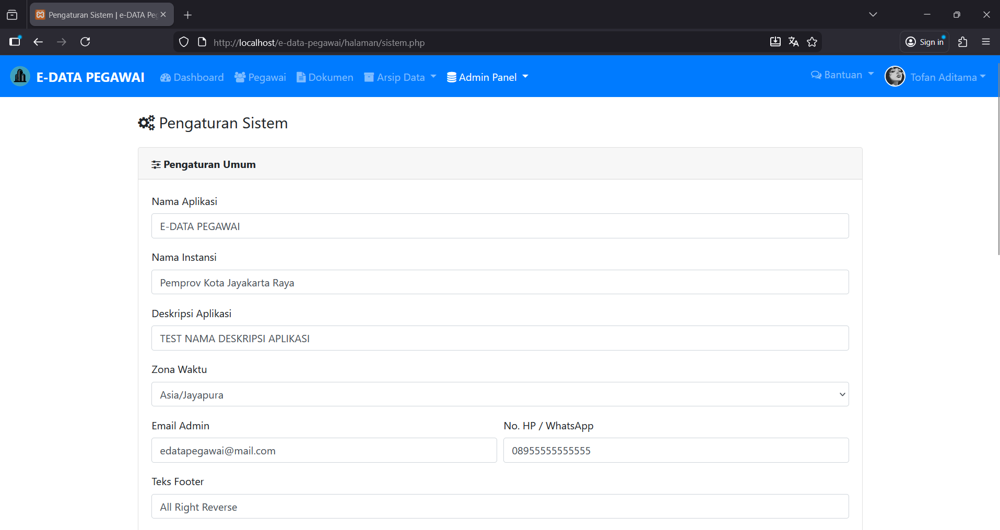
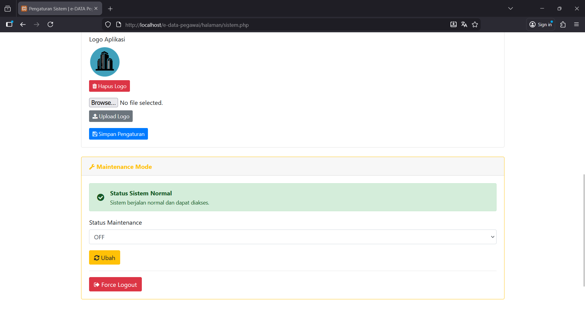
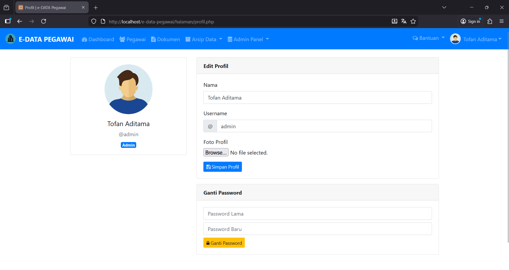

# e-DATA Pegawai

e-DATA Pegawai adalah aplikasi manajemen data pegawai berbasis web** yang dibangun menggunakan PHP Native dan MySQL.  
Aplikasi ini dirancang untuk membantu instansi atau organisasi dalam mengelola data pegawai, dokumen, arsip, dan pengumuman secara terstruktur dan aman.

## Fitur Utama

-  **Login & Hak Akses**
  - Role-based access (Admin & Petugas)
  - Session-based authentication
  - Proteksi halaman (auth & admin guard)

-  **Manajemen Pegawai**
  - Tambah, edit, hapus pegawai
  - Nonaktif & restore pegawai
  - Arsip data pegawai

-  **Manajemen Dokumen**
  - Upload & kelola dokumen pegawai
  - Dokumen berlaku & kadaluarsa
  - Arsip & restore dokumen
  - Proteksi file upload

-  **Pengumuman**
  - Buat & kelola pengumuman
  - Pin / unpin pengumuman
  - Status aktif / nonaktif

-  **Pengaturan Sistem**
  - Nama aplikasi & instansi
  - Logo aplikasi
  - Zona waktu
  - Kontak admin (Email & WhatsApp)
  - Mode maintenance

-  **Fitur Tambahan**
  - CSRF Token
  - Captcha login
  - Maintenance mode
  - Notifikasi & flash message

---

## Teknologi yang Digunakan

- **Backend**: PHP Native (7+)
- **Database**: MySQL
- **Frontend**: Bootstrap 4
- **Icon**: Font Awesome
- **Javascript**: jQuery
- **Server**: Apache (XAMPP / Laragon)

---

## Keamanan
- Session-based authentication
- CSRF protection
- Access guard (auth & admin)
- Validasi input
- Proteksi file upload
- File konfigurasi sensitif **tidak disertakan di repository**

---

## Preview Aplikasi

Beberapa tampilan utama aplikasi:

- Dashboard
- Data Pegawai
- Dokumen & Arsip
- Pengaturan Sistem
- Halaman Profil

## Preview Aplikasi

### Halaman Login


### Dashboard / Beranda


### Halaman Pegawai


### Halaman Dokumen


### Halaman Arsip



### Halaman Admin / Sistem



### Halaman Profil



---

## Instalasi (Local Development)

1. Clone repository:
   ```bash
   git clone https://github.com/putra44/e-data-pegawai.git

2. Masuk ke folder project
   ```bash
   cd e-data-pegawai
3. Salin file konfigurasi database:
   ```bash
   cp config/database.example.php config/database.php
4. Atur koneksi database di config/database.php
5. Import database MySQL
6. Jalankan di server lokal (XAMPP / Laragon)

